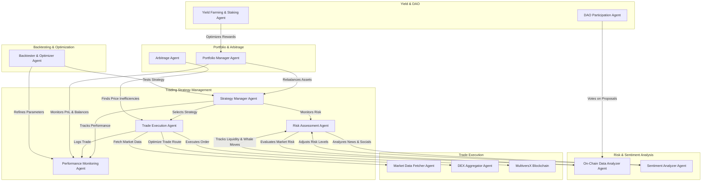

[Project Flowchart](https://www.mermaidchart.com/app/projects/de08f005-1a1e-4177-9f4c-acbd14803885/diagrams/263f2a60-0834-4b63-b0d1-ebcfbf26c118/version/v0.1/edit)

# BigBull.ai 🚀

### AI-Driven, Multi-Agent Trading for Smarter Investments 💰

[-@BigBull_AI-1DA1F2?style=flat&logo=twitter)](https://x.com/BigBull_AI)  
[](https://bigbull-ai.gitbook.io/bigbull_ai)  
[](https://t.me/+4Jn0pxIz-3gxYjVl)  
[](https://www.canva.com/design/DAGhUfAiiGw/o2N-Z8_9wCdjWfjpUl2_2A/edit?utm_content=DAGhUfAiiGw&utm_campaign=designshare&utm_medium=link2&utm_source=sharebutton)

---

## 🌟 Introduction

AI is booming, and we want AI to **make money for everyone**. That’s why we created **BigBull.ai** – an AI-powered trading platform that enables users to **fund an AI agent and let it trade on their behalf** with **optimized strategies**.

Our key focus is on **Dollar Cost Averaging (DCA)**, allowing users to enter and exit markets at the right time, making **consistent profits** while minimizing risk. 

---

## 🚀 Features & Trading Strategies

BigBull.ai leverages advanced **AI-driven trading techniques** and **machine learning models** to make intelligent trading decisions. Here’s what we offer:

### 📈 **Technical Indicator-Based Trading**
- **Moving Averages (SMA & EMA):** Detects short-term and long-term trend reversals.
- **Relative Strength Index (RSI):** Identifies overbought (>70) and oversold (<30) conditions.
- **Bollinger Bands:** Measures price volatility and helps identify breakout opportunities.
- **MACD (Moving Average Convergence Divergence):** Tracks momentum shifts for trend-following trades.
- **Volume Weighted Average Price (VWAP):** Ensures trades align with market liquidity trends.

### 📊 **Momentum & Trend-Following Strategies**
- **Moving Average Crossover Strategy:** Buy signal when short-term EMA crosses above long-term EMA, sell on the opposite.
- **Ichimoku Cloud Strategy:** Identifies strong bullish/bearish trends based on cloud analysis.

### 🔄 **Mean Reversion Strategies**
- **RSI-Based Mean Reversion:** Buy when RSI < 30, sell when RSI > 70.
- **Bollinger Bands Reversion:** Buy at lower band, sell at upper band.

### 💥 **Breakout Trading**
- **Support & Resistance Breakout:** Trades execute when the price breaks above resistance or below support.
- **Volume-Confirmed Breakouts:** Breakouts with high volume indicate stronger price movements.

### 🧠 **Machine Learning-Based Trading**
- **Regression Models (Random Forest, XGBoost):** Predicts short-term price movements.
- **LSTM (Long Short-Term Memory):** Forecasts future price sequences.
- **Reinforcement Learning (RL):** AI agent dynamically adjusts trade execution for maximum returns.

---

## 🔍 Backtesting & Strategy Evaluation
Before deploying, all strategies undergo rigorous **backtesting using historical STRK/USDT data**:
- **Simulated Trading:** Testing strategies against past market conditions.
- **Performance Metrics:** Evaluating returns, Sharpe ratio, max drawdown, and win rate.
- **Risk Analysis:** Optimizing strategies to minimize losses and maximize gains.

---

## ⚡ Live Trading & Automation
BigBull.ai integrates seamlessly with major crypto exchanges for **real-time execution**:
- **Exchange API Integration:** Fetching live data from Binance & OKX APIs.
- **WebSocket Streams:** Enabling real-time trade execution.
- **Risk Management:** Includes stop-loss, take-profit, and position sizing rules.
- **Dynamic Strategy Optimization:** AI-based parameter tuning based on past performance.

---

## 🛠️ Problems We Solve

❌ **Fragmented Liquidity** – Lack of seamless cross-chain trading and liquidity aggregation.

❌ **Complex User Experience** – High barriers to entry due to confusing workflows.

❌ **Inefficient Risk Management** – Lack of automated tools for real-time risk assessment and portfolio optimization.

✅ **AI-Driven Trading** – Multi-agent system for smart execution and market insights.

✅ **Cross-Chain Liquidity** – Seamless token swaps across multiple blockchains with low fees.

✅ **Automated Risk & Performance Management** – Real-time assessment and portfolio tracking.

---

## 🤖 Multi-Agent System: A Smarter Way to Trade

| **Aspect**         | **Single-Agent Trading** | **Multi-Agent Trading (BigBull.ai)** |
|--------------------|----------------------|--------------------------------|
| **Complexity**    | Handles specific tasks independently | Coordinates multiple agents for dynamic decision-making |
| **Adaptability**  | Follows fixed strategies | Adapts to market changes in real-time |
| **Performance**   | Slower decision-making | Faster execution with parallel processing |

---


## 🏁 Getting Started

### 🚀 Steps to Access the Frontend
```sh
# Clone the repository
git clone https://github.com/Mihir7b311/BigBull_AI/

# Navigate to frontend directory
cd BigBull_AI/frontend

# Install dependencies
npm install

# Setup environment variables and start the project
npm start
```

---

## 💬 Community & Support
Join our community for updates, discussions, and support:
- 📢 **Twitter:** [@BigBull_AI](https://x.com/BigBull_AI)
- 📖 **Docs:** [BigBull AI GitBook](https://bigbull-ai.gitbook.io/bigbull_ai)
- 📨 **Email:** buddyharshal2751@gmail.com
- 💬 **Telegram:** [Join the Chat](https://t.me/+4Jn0pxIz-3gxYjVl)

---

## 🚀 Thank You!
BigBull.ai is an exciting opportunity to **revolutionize trading** using **AI-powered automation**. Thank you for supporting our journey – let's build the future of AI-driven trading together! 🚀💰


