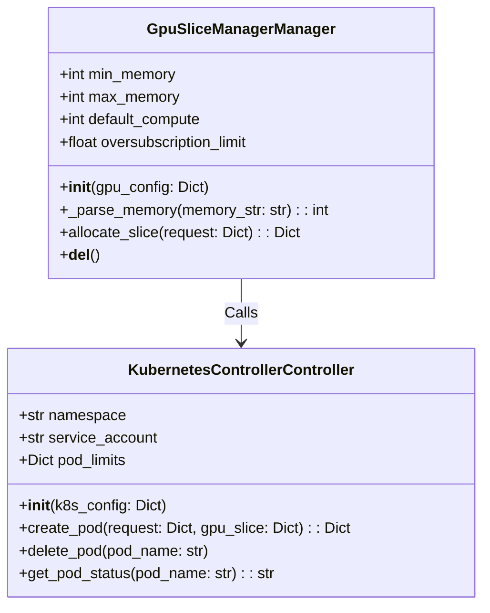
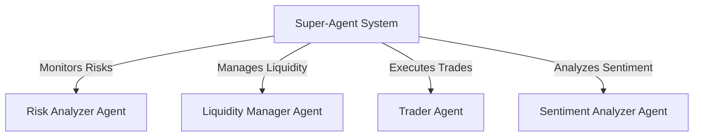
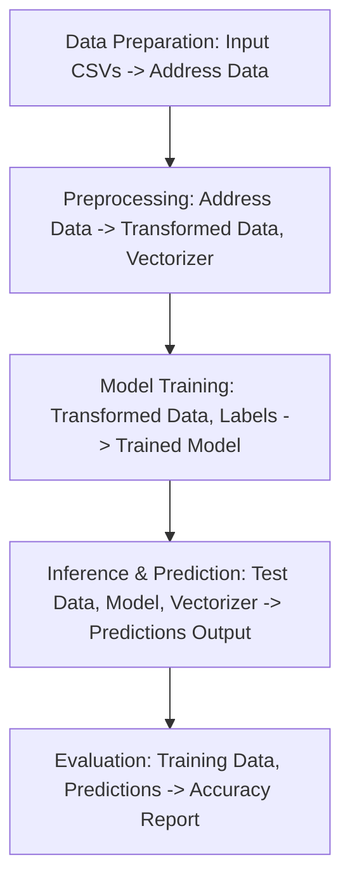
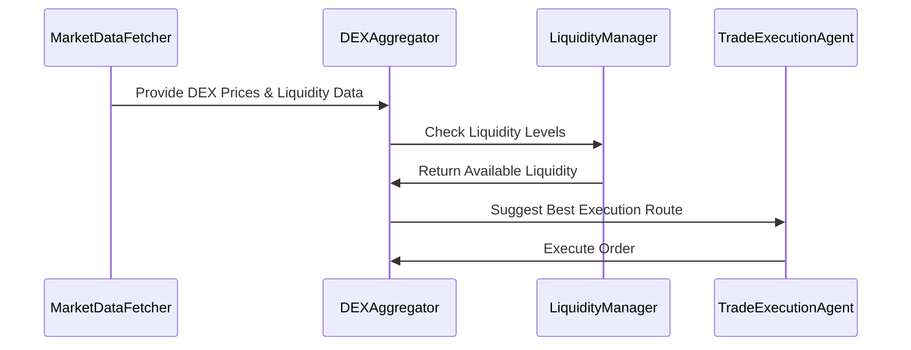

# BigBull_AI

[Project Flowchart](https://www.mermaidchart.com/app/projects/de08f005-1a1e-4177-9f4c-acbd14803885/diagrams/263f2a60-0834-4b63-b0d1-ebcfbf26c118/version/v0.1/edit)

# README

## System Architecture

### GPU Slice Management

### Super-Agent System

### Data Processing Workflow

### Trade Execution Sequence

